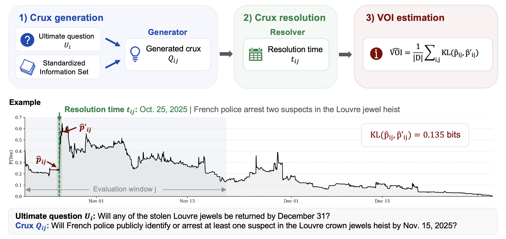

# CruxBench: A Benchmark of Information Discovery

CruxBench evaluates information discovery: whether a language model can identify which questions are worth asking. For a target forecasting question, a model proposes a *crux*, a subquestion whose answer is a key step toward the target. CruxBench grades each crux by its value of information (VOI), how much its resolution updates beliefs about the target question, measured from the question's Polymarket price history. This release covers 293 target forecasting questions and eight evaluated models.

<p align="center">
  
</p>

## Setup

Python 3.10 or newer.

```bash
pip install -r requirements.txt
cp .env.example .env   # add API keys only for the steps you run
```

## Pipeline

Each step reads the previous step's output. Default models and settings match the paper and are set in `config.py`.

```bash
# 1. Retrieve news articles
python scripts/step1_retrieve.py --input ultimates.json --output ultimates_w_news.json

# 2. Generate one crux per window
python scripts/step2_generate.py --model gpt-5.4

# 3a. Resolve cruxes
python scripts/step3a_resolve.py --output-dir outputs/gpt-5.4

# 3b. Verify resolution timestamps
python scripts/step3b_verify.py

# Downstream forecasting (Figure 3)
python scripts/forecast_baseline.py
python scripts/forecast_with_crux.py --generator gpt-5.4
```

Models are addressed by name (`claude-*`, `gpt-*`, `gemini-*`) or with a provider prefix (`together/...`, `vllm/...`, `openrouter/...`).

## Reproducing the paper

The notebooks run on the released data and need no API keys. Run them from the `notebook/` directory.

| Notebook | Reproduces |
|---|---|
| `01_main_results.ipynb` | Table 1, Figures 2–4 |
| `02_additional_results.ipynb` | Appendix metrics table and averaging-window robustness |

## Data

| Path | Contents |
|---|---|
| `data/ultimates.json` | The 293 questions, each with its selected 30-day window |
| `data/ultimates_w_news.json` | Same, with the AskNews articles given to generators and forecasters |
| `data/hourly_prices_trusted/` | Volume-adjusted hourly prices used for VOI |
| `data/hourly_prices/`, `data/hourly_activity/` | Raw hourly prices and on-chain trading volume used to build them |
| `data/epoch_eci_scores_2026-09-22.csv` | Epoch Capability Index snapshot used in Figure 2 |
| `outputs/<generator>/` | `subquestions.json` (step 2), `resolved_raw.json` (step 3a), `resolved.json` (step 3b) |
| `outputs/timestamp_verifications.json` | Step 3b decisions, with original and verified timestamps |
| `outputs/crossmodel_similarity_pairs.json` | Pairwise crux cosine similarities for Figure 4 |
| `outputs_forecast/<forecaster>/` | Baseline and crux-informed forecasts |

The released `resolved_raw.json` and `resolved.json` files omit the resolver's search logs.

## Dataset construction

`data_collection/` rebuilds the question set and price data from Polymarket. Run from the repository root:

```bash
python data_collection/fetch_polymarket.py
python data_collection/filter.py --input data/polymarket_0325.json --output data/ultimates_pre_volume.json --skip-window-volume-filter
python data_collection/fetch_hourly_prices.py
POLYGON_RPC_URL=<url> python data_collection/fetch_hourly_activity.py
python data_collection/filter.py --input data/polymarket_0325.json --output data/ultimates.json
python data_collection/build_trusted_prices.py
```

The paper uses a Polymarket snapshot from 2026-03-25.
